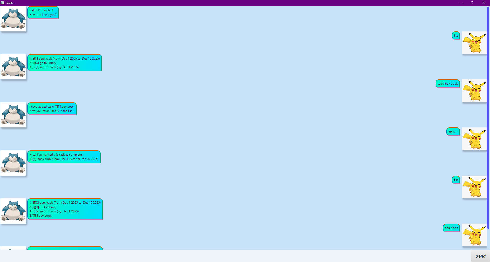

# Jordan User Guide

## Ui of Jordan


Jordan is a desktop task management application designed for fast typists. It helps you manage todos, deadlines, and events efficiently using a Command Line Interface (CLI).

## Quick Start

1. Ensure you have Java 11 or above installed.
2. Download the latest `jordan.jar` from the releases.
3. Double-click the file to start the app, or run `java -jar jordan.jar` in your terminal.

## Features

### Adding a Todo: `todo`

Adds a simple todo task.

**Format:**  
`todo TASK_DESCRIPTION`

**Example:**  
`todo read book`

**Expected Outcome:**  
```
I have added task:
[T][ ] read book
Now you have 1 task in the list.
```

---

### Adding a Deadline: `deadline`

Adds a task that must be done by a specific date/time.

**Format:**  
`deadline TASK_DESCRIPTION /by DATE (yyyy-mm-dd)`

**Example:**  
`deadline submit report /by 2024-06-30`

**Expected Outcome:**  
```
I have added task:
[D][ ] submit report (by: Jun 30 2024)
Now you have 2 tasks in the list.
```

---

### Adding an Event: `event`

Adds a task that occurs at a specific date/time.

**Format:**  
`event TASK_DESCRIPTION /from DATE (yyyy-mm-dd) /to DATE (yyyy-mm-dd)`

**Example:**  
`event team meeting /from 2024-07-01 /to 2024-07-07`


**Expected Outcome:**  
```
I have added task:
[E][ ] team meeting (from: Jul 1 2024 to: Jul 7 2024)
Now you have 3 tasks in the list.
```

---

### Listing All Tasks: `list`

Shows all tasks in your list.

**Format:**  
`list`

**Expected Outcome:**  
```
1. [T][ ] read book
2. [D][ ] submit report (by: Jun 30 2024)
3. [E][ ] team meeting (from: Jul 1 2024 to: Jul 7 2024)
```

---

### Marking a Task as Done: `mark`

Marks a specified task as completed.

**Format:**  
`mark INDEX`

**Example:**  
`mark 2`

**Expected Outcome:**  
```
Nice! I've marked this task as complete!
[D][X] submit report (by: Jun 30 2024)
```

---

### Deleting a Task: `delete`

Deletes a specified task from your list.

**Format:**  
`delete INDEX`

**Example:**  
`delete 1`

**Expected Outcome:**  
```
I have removed this task.
[T][ ] read book
Now you have 2 tasks in the list.
```

---

### Finding Tasks by Keyword: `find`

Finds tasks that contain a given keyword.

**Format:**  
`find KEYWORD`

**Example:**  
`find book`

**Expected Outcome:**  
```
Here are the matching tasks in your list:
1. [T][ ] read book
```

---

### Exiting the Program: `bye`

Exits the application.

**Format:**  
`bye`

---

## Command Summary

| Action      | Format                                                                |
|-------------|-----------------------------------------------------------------------|
| Add todo    | `todo TASK_DESCRIPTION`                                               |
| Add deadline| `deadline TASK_DESCRIPTION /by DATE (yyyy-mm-dd)`                     |
| Add event   | `event TASK_DESCRIPTION /from DATE (yyyy-mm-dd) /to DATE (yyyy-mm-dd)`|
| List tasks  | `list`                                                                |
| Mark tasks  | `mark INDEX`                                                          |
| Delete task | `delete INDEX`                                                        |
| Find tasks  | `find KEYWORD`                                                        |
| Exit        | `bye`                                                                 |
